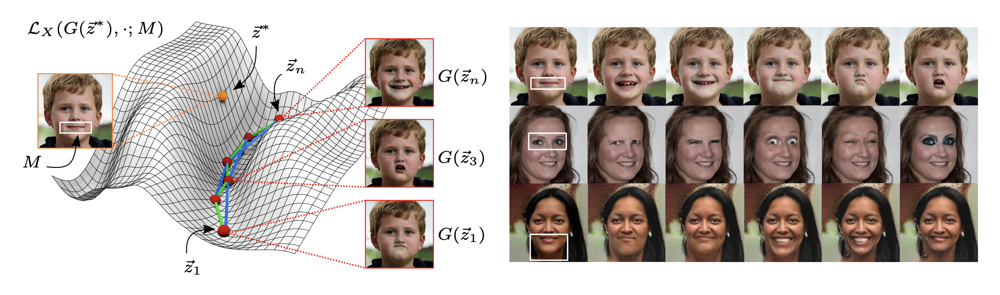
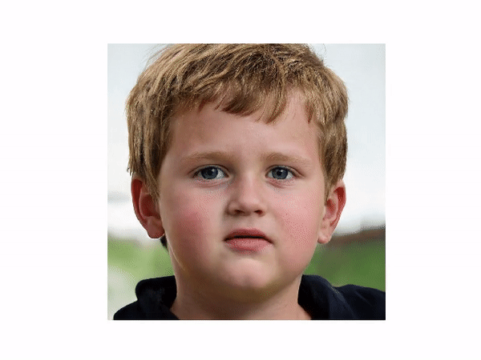
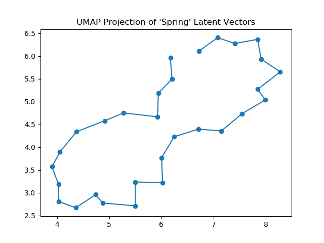

# Mask-Guided Discovery of Semantic Manifolds in Generative Models

Mask-Guided Discovery of Semantic Manifolds in Generative Models(https://mengyu.page/files/workshop.pdf)
  [Mengyu Yang](https://mengyu.page/),
  [David Rokeby](https://www.cdtps.utoronto.ca/people/directories/all-faculty/david-rokeby),
  [Xavier Snelgrove](https://wxs.ca/) 
  BMO Lab for Creative Research, University of Toronto  
Workshop on Machine Learning for Creativity and Design (NeurIPS), 2020 

A mask-guided, optimization based approach to learning semantic manifolds in StyleGAN2. Given an initial latent vector, this method finds additional vectors corresponding to the same image but with changes localized within the mask region. 

## Usage 

First, download the converted StyleGAN2 checkpoint for its PyTorch implementation [here](https://drive.google.com/file/d/1v0iLBeuaegDZb3BIBb1CSmfsNSRiNWqI/view?usp=sharing) and put it in the same directory as the rest of the code. 

Dependencies: 

* PyTorch 
* matplotlib
* numpy
* PIL
* lpips 
* umap 
* tqdm 

### Generate Vectors 

> python run.py 

This method contains different arguments for hyperparameters controlling the weights of each loss term, the mask offset value, and the primary spring loss distance. Additional arguments also specify items such as the mask region, number of output vectors, and optimization epochs. Defaults have been set for all these arguments so the method can be easily used. 

To see a list of all arguments with explanations: 

> python run.py -h 

### Output Files 

Under the default arguments, once the optimization finishes, the resulting latent vectors will be saved in file `{exp_name}_latents.pt`, the corresponding images will be saved in a new directory called `{exp_name}_imgs`, and a plot of the UMAP projection (https://arxiv.org/abs/1802.03426) of the latent vectors will be saved as `{exp_name}_UMAP.png`. `exp_name` is by default set to `masked_gan_exp` but this can be changed by:

> python run.py --exp_name {NEW_EXPERIMENT_NAME}

## Output Examples 

Animation created from images generated using a mask region around the mouth. The mask offset is slowly increased as the animation progresses. 

A UMAP projection of output latent vectors. 

